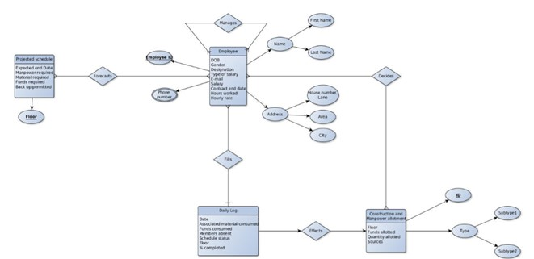

# Construction-Site-Management-System
Construction Site Management System using HTML and php

In the following project php and MySQL have been used.

In this project the database made is construction_site and the schema is:  
emp_details= (emp_id, fname, lname, house_no, lane, area, city, dob, gender, designation, tos, email, salary, dot, hrs_w, hrly_rate, floor_w)  
The queries used in this project are:   
* Query used to display the entered values.
* Query to update a value.

