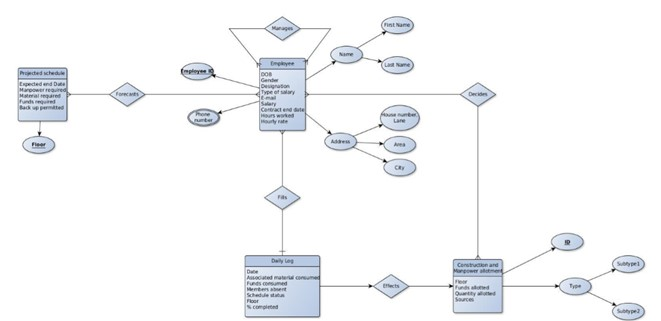

# Construction-Site-Management-System
Construction Site Management System using HTML and php

In the following project php and MySQL have been used.

In this project the database made is construction_site and the schema is:  
emp_details= (emp_id, fname, lname, house_no, lane, area, city, dob, gender, designation, tos, email, salary, dot, hrs_w, hrly_rate, floor_w)  
The queries used in this project are:   
* Query used to display the entered values.
* Query to update a value.

### ER Diagram:

##### Entities: 
* Employee: Employee id, Name, Address, DOB, Gender, Designation, Type of Salary, email, hrs worked, hrly rate, floor
* Projected Schedule: Floor, Work, Designation, Material Name, End Date, Man Quantity,Material Quantity, Funds
* Daily Log: Floor, Work, Material Name, Quantity, Funds Consumed, Members Absent, % Complete, Work
* Construction and Manpower Allotment: ID, Floor, Funds Allotted, Quantity Allotted, Sources

### Project Description: 
* Each entity in the ER diagram becomes a table in the relational model. The multivalued attributes become a separate table.
* Each Table is checked for anomalies and dependencies like functional dependencies, partial dependency and multivalued dependency. Then each table is normalized to remove
anomalies and dependencies to make the data more consistent.   
The languages used for the production of the web application are, Html, Css, Javascript and Php. For the server side programming Php was used along with Mysql
for database creation and connectivity. The first step was to create the necessary tables on the machine’s database. This
was done using the command line tool provided by MySQL. This was followed by creation of the front-end part for user’s interaction with the application and thereby
with the database. Server side scripting was used for all the database related operations such as insertion, updation, deletion and viewing of the records.
All the relationships were reflected in the working of the application by the use of normalized table combined with the server-side scripting.
